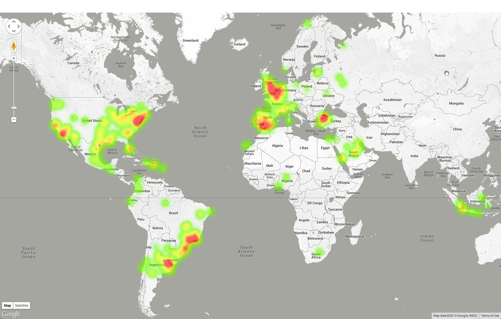

twitter-streaming-nodejs
========================

Shows how to stream real time twitter data to Google Maps using NodeJS.

<h2>Step 1: Configure Twitter API creds</h2>
Update Cloudfoundry application manifest to include your Twitter credentials in the evnironment variables

<h2>Step 2: Push App</h2>
execute "cf push"

